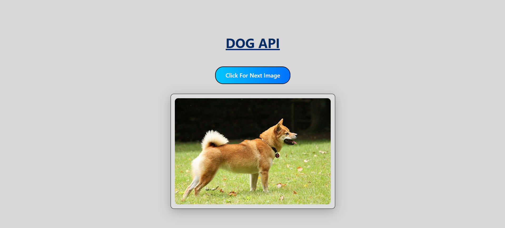

Link: https://dog-api-js.vercel.app/

# Dog API JS

A simple web application that displays random dog images using the [Dog CEO's Dog API](https://dog.ceo/dog-api/).

## Features
- Fetches and displays a random dog image.
- "Click For Next Image" button to load a new image.
- Loading indicator while fetching images.
- Responsive design using Bootstrap 5.

## How to Use
1. Open `index.html` in your browser.
2. Click the **Click For Next Image** button to see a new random dog image.

## Project Structure
- `index.html` - Main HTML file.
- `style.css` - Custom styles.
- `script.js` - JavaScript logic for fetching and displaying images.
- `output/` - Contains screenshots or output images (e.g., `Dog_API.png`).

## Screenshot

## Credits
- [Dog CEO's Dog API](https://dog.ceo/dog-api/)
- [Bootstrap 5](https://getbootstrap.com/)